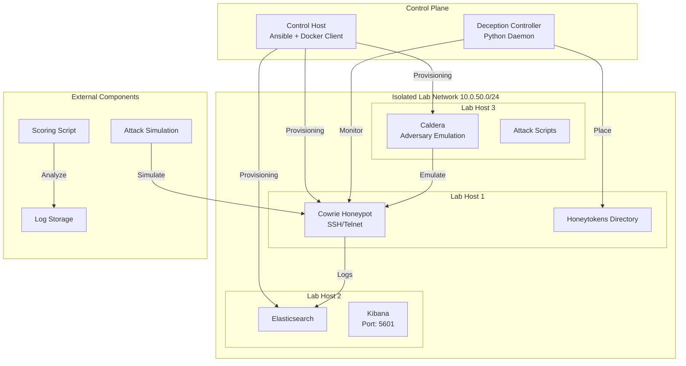

# 🛡️ Deception-Enhanced Red Team Training Lab

> **CSC786: Computer Science Problems - Assignment 4 Implementation**  
> An isolated cyber range integrating proactive deception mechanisms for realistic red team training and research.

[](https://opensource.org/licenses/MIT)
[](https://www.python.org/)
[](https://www.ansible.com/)
[](https://www.docker.com/)

## 📋 Table of Contents
- [Overview](#overview)
- [Architecture](#architecture)
- [Features](#features)
- [Prerequisites](#prerequisites)
- [Quick Start](#quick-start)
- [Detailed Setup](#detailed-setup)
- [Usage](#usage)
- [Evaluation](#evaluation)
- [Project Structure](#project-structure)
- [Ethical Considerations](#ethical-considerations)
- [Contributing](#contributing)
- [License](#license)
- [References](#references)

## 🌟 Overview

This project implements a **Deception-Enhanced Red Team Training Lab** - an isolated cyber range that integrates proactive deception mechanisms into traditional red team training environments. The system provides a safe, controlled sandbox for practicing offensive security techniques while implementing adaptive defensive deception.

**Core Objectives:**
- ✅ **Safe Isolation**: Fully contained network with no external connectivity
- ✅ **Adaptive Deception**: Honeytokens placed in response to attacker behavior
- ✅ **Infrastructure-as-Code**: Reproducible environment using Ansible & Docker
- ✅ **Quantitative Evaluation**: Mean Time to Detect (MTTD) and other metrics
- ✅ **Integrated Tooling**: Cowrie honeypot, ELK stack, and Caldera adversary emulation

## 🏗️ Architecture



## ✨ Features

### 🔧 Infrastructure Automation
- **Ansible Playbooks**: Idempotent provisioning of all lab hosts
- **Docker Compose**: Containerized services with isolated networking
- **Standardized Directory Structure**: Consistent paths across all hosts

### 🎯 Adaptive Deception
- **Python Deception Controller**: Monitors logs and responds to attacks
- **Dynamic Honeytoken Placement**: Places decoy files based on attacker behavior
- **Audit Trail**: Complete logging of all deception actions

### 📊 Monitoring & Analysis
- **ELK Stack**: Centralized logging with Elasticsearch and Kibana visualization
- **Cowrie Honeypot**: Medium-interaction SSH/Telnet honeypot
- **Metric Collection**: Automated MTTD calculation and performance analysis

### ⚔️ Attack Simulation
- **Caldera Integration**: MITRE adversary emulation platform
- **Custom Probe Scripts**: Automated SSH brute-force simulation
- **Controlled Environment**: Safe, isolated attack generation

## 📋 Prerequisites

### Hardware/Software Requirements
- **Virtualization**: VirtualBox, VMware, or KVM
- **RAM**: Minimum 8GB (16GB recommended)
- **Storage**: 40GB free disk space
- **OS**: Ubuntu 22.04 LTS (control and lab hosts)

### Required Software
```bash
# Control Host
sudo apt-get update
sudo apt-get install -y python3-pip ansible git

# Ansible requirements
pip3 install docker

# Docker (if not using system packages)
curl -fsSL https://get.docker.com -o get-docker.sh
sudo sh get-docker.sh
```

## 🚀 Quick Start

### 1. Clone the Repository
```bash
git clone https://github.com/0xTestbuild/csc786.git
cd csc786
```

### 2. Configure Virtual Machines
Create three Ubuntu 22.04 VMs with these network settings:
- **Network**: Host-only or internal network (10.0.50.0/24)
- **Lab Host 1**: 10.0.50.10
- **Lab Host 2**: 10.0.50.11  
- **Lab Host 3**: 10.0.50.12

### 3. Update Inventory
Edit `ansible/inventory.ini`:
```ini
[lab_hosts]
lab1 ansible_host=10.0.50.10 ansible_user=ubuntu ansible_ssh_private_key_file=~/.ssh/id_rsa
lab2 ansible_host=10.0.50.11 ansible_user=ubuntu ansible_ssh_private_key_file=~/.ssh/id_rsa
lab3 ansible_host=10.0.50.12 ansible_user=ubuntu ansible_ssh_private_key_file=~/.ssh/id_rsa
```

### 4. Deploy the Lab
```bash
# Provision all lab hosts
ansible-playbook -i ansible/inventory.ini ansible/site.yml

# Start all services (on lab1)
ansible lab1 -i ansible/inventory.ini -m shell -a "cd /opt/deception_lab/docker && docker compose up -d"

# Start deception controller
python3 deception_controller/deception_controller.py
```

### 5. Run an Attack Simulation
```bash
python3 scripts/run_ssh_probe.py --target 10.0.50.10 --port 2222
```

### 6. View Results
- **Kibana Dashboard**: http://10.0.50.11:5601
- **Caldera Interface**: http://10.0.50.12:8888
- **Calculate MTTD**: `python3 scoring/scoring.py`

## 📖 Detailed Setup

### Network Configuration
For complete isolation, configure your VMs with:
- **No NAT** or bridged networking
- **Host-only adapter** with static IPs in 10.0.50.0/24
- **No internet access** from lab hosts

### SSH Key Setup
```bash
# Generate SSH key if needed
ssh-keygen -t rsa -b 4096

# Copy to lab hosts
ssh-copy-id ubuntu@10.0.50.10
ssh-copy-id ubuntu@10.0.50.11
ssh-copy-id ubuntu@10.0.50.12
```

### Ansible Playbook Details
The main playbook (`ansible/site.yml`) performs:
- Docker CE installation and configuration
- User and group setup for Docker management
- Directory creation for logs and deception artifacts
- `docker-compose` installation via pip fallback

### Docker Services
Services defined in `docker/docker-compose.yml`:

| Service | Ports | Purpose |
|---------|-------|---------|
| Cowrie | 22, 2222, 23 | SSH/Telnet honeypot |
| Elasticsearch | 9200 | Log storage and indexing |
| Kibana | 5601 | Log visualization dashboard |
| Caldera | 8888 | Adversary emulation platform |

## 🎮 Usage

### Starting the System
```bash
# Full deployment sequence
./scripts/deploy_all.sh

# Or manually:
# 1. Provision infrastructure
ansible-playbook -i ansible/inventory.ini ansible/site.yml

# 2. Start containers on each host
ansible lab_hosts -i ansible/inventory.ini -m shell -a "cd /opt/deception_lab/docker && docker compose up -d"

# 3. Start deception controller
cd deception_controller
python3 deception_controller.py --interval 5 --log-dir /opt/deception_lab/logs
```

### Attack Simulation Options
```bash
# Basic SSH probe
python3 scripts/run_ssh_probe.py --target 10.0.50.10 --port 2222 --attempts 50

# Custom username/password list
python3 scripts/run_ssh_probe.py --target 10.0.50.10 --users users.txt --passwords passwords.txt

# Caldera-based attacks
# Access Caldera at http://10.0.50.12:8888
# Use default credentials: red/admin
```

### Viewing Logs and Metrics
```bash
# View deception controller audit log
tail -f /opt/deception_lab/logs/deception_controller_audit.log

# View Cowrie logs
docker logs -f docker-cowrie-1

# Calculate performance metrics
python3 scoring/scoring.py --cowrie-logs /opt/deception_lab/logs/cowrie/ --audit-log /opt/deception_lab/logs/deception_controller_audit.log
```

## 📊 Evaluation

### Key Metrics
The system calculates several performance metrics:

1. **Mean Time to Detect (MTTD)**: Average delay between attack and deception response
2. **Detection Rate**: Percentage of attacks that trigger deception responses
3. **False Positive Rate**: Benign activity incorrectly flagged as attacks

### Running Evaluation
```bash
# Full evaluation pipeline
cd scoring
python3 scoring.py --generate-report

# Individual components
python3 calculate_mttd.py
python3 detection_rate.py
python3 false_positive.py
```

### Sample Output
```
=== Deception Lab Evaluation Results ===
Evaluation Period: 2025-11-23 10:00:00 to 2025-11-23 11:30:00
Total Attack Events: 40
Deception Responses: 40 (100% detection rate)
Mean Time to Detect: 5.2 seconds
False Positives: 0 (0% false positive rate)
Attack Sources: 1 unique IPs
```

## 📁 Project Structure

```
csc786/
├── ansible/
│   ├── site.yml              # Main Ansible playbook
│   ├── inventory.ini         # Lab host inventory
│   └── roles/                # (Optional) Ansible roles
│       └── docker/
├── docker/
│   ├── docker-compose.yml    # Service orchestration
│   ├── cowrie/
│   │   └── cowrie.cfg       # Honeypot configuration
│   ├── elk/
│   │   └── kibana.yml       # Kibana configuration
│   └── caldera/
│       └── local.yml        # Caldera configuration
├── deception_controller/
│   ├── deception_controller.py  # Main controller logic
│   ├── honeytokens/          # Honeytoken templates
│   ├── requirements.txt      # Python dependencies
│   └── config.yaml          # Controller configuration
├── scoring/
│   ├── scoring.py           # Main scoring script
│   ├── calculate_mttd.py    # MTTD calculation
│   └── report_template.md   # Report template
├── scripts/
│   ├── run_ssh_probe.py     # Attack simulation
│   ├── deploy_all.sh        # Full deployment script
│   └── health_check.py      # System health verification
├── docs/
│   ├── architecture.md      # Detailed architecture
│   ├── ethical_guidelines.md # Usage guidelines
│   └── troubleshooting.md   # Common issues and fixes
├── tests/
│   ├── test_controller.py   # Unit tests for controller
│   └── test_scoring.py      # Unit tests for scoring
├── .github/
│   └── workflows/           # CI/CD workflows
├── .gitignore
├── LICENSE
├── README.md                # This file
└── requirements.txt         # Global Python dependencies
```

## ⚖️ Ethical Considerations

### **CRITICAL WARNINGS**
⚠️ **THIS LAB MUST REMAIN ISOLATED** - Never connect to production networks  
⚠️ **USE SYNTHETIC DATA ONLY** - No real credentials or sensitive information  
⚠️ **EDUCATIONAL USE ONLY** - Not for production security testing  

### Safety Features
- **Network Isolation**: All traffic contained within 10.0.50.0/24
- **Synthetic Credentials**: Only test/default credentials used
- **Audit Logging**: All actions logged for review and accountability
- **Controlled Environment**: No external connectivity from lab hosts

### Responsible Use Guidelines
1. **Informed Consent**: If using with trainees, explain the monitoring and deception
2. **Data Handling**: Anonymize any participant data in logs
3. **Compliance**: Follow institutional policies and IRB requirements
4. **Disclosure**: Clearly document the deceptive nature of the environment

## 🤝 Contributing

Contributions are welcome! Please follow these steps:

1. **Fork** the repository
2. **Create a feature branch**: `git checkout -b feature/amazing-feature`
3. **Commit changes**: `git commit -m 'Add amazing feature'`
4. **Push to branch**: `git push origin feature/amazing-feature`
5. **Open a Pull Request**

### Development Setup
```bash
# Set up development environment
python3 -m venv venv
source venv/bin/activate
pip install -r requirements.txt
pip install -r deception_controller/requirements.txt

# Run tests
pytest tests/

# Code formatting
black deception_controller/ scripts/ scoring/
flake8 deception_controller/ scripts/ scoring/
```

## 📄 License

This project is licensed under the MIT License - see the [LICENSE](LICENSE) file for details.

## 📚 References

### Academic Papers
1. Provos, N., & Holz, T. (2007). *Virtual Honeypots: From Botnet Tracking to Intrusion Detection*
2. Al-Shaer, E., et al. (2013). *Modeling and Management of Deception in Network Security*

### Tools & Frameworks
- [Cowrie Honeypot](https://github.com/cowrie/cowrie)
- [MITRE CALDERA](https://github.com/mitre/caldera)
- [ELK Stack](https://www.elastic.co/elastic-stack/)
- [Ansible](https://www.ansible.com/)

### Related Projects
- [Modern Honeynet](https://github.com/t4d/Modern-Honeynet)
- [T-Pot Honeypot](https://github.com/telekom-security/tpotce)
- [DetectionLab](https://github.com/clong/DetectionLab)

## 🙏 Acknowledgments

- **CSC786 Course Instructors** for guidance and feedback
- **Open Source Community** for the amazing tools that make this project possible
- **MITRE ATT&CK Framework** for providing structured adversary emulation

---

**⚠️ Disclaimer**: This project is for educational and research purposes only. The authors assume no liability for any misuse of this software. Users are responsible for ensuring their use complies with all applicable laws and regulations.

**📧 Contact**: For questions or issues, please open a GitHub Issue or contact the repository maintainer.

---
*Last updated: November 2025*
